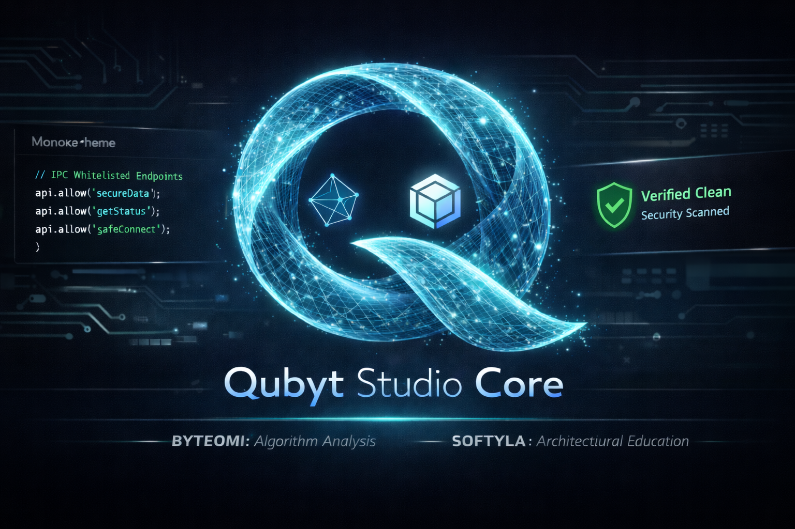

# 🚀 Qubyt Studio: Modern Code Editor Ecosystem

> ✓ **Güncel** — Bu README Mart 2026 itibarıyla proje durumunu yansıtmaktadır.

Qubyt Studio, modern web teknolojileri ile geliştirilmiş, fütüristik arayüzü ve yüksek performanslı kod yazma deneyimi ile yazılım geliştirme süreçlerini bir üst seviyeye taşımak için tasarlanmıştır.

## 🌟 Öne Çıkan Özellikler

- **Monaco Editor Entegrasyonu:** VS Code'un kalbi olan Monaco ile en üst düzey kod yazma deneyimi.
- **Fütüristik UI/UX:** Yazılımcılar için özel olarak tasarlanmış, derinlik ve estetik odaklı arayüz.
- **3D Desteği:** Three.js ve Babylon.js gibi kütüphanelerle 3D sahne entegrasyonu planları.
- **Hız ve Hafiflik:** Electron tabanlı optimize edilmiş yapı ile hızlı başlangıç.

## 🚀 Yerelde Çalıştırma

Geliştiriciler ve meraklı kullanıcılar için kaynak koddan çalıştırma:

1. Repoyu klonlayın: `git clone https://github.com/qubyt-studio/qubyt-studio-core.git`
2. Bağımlılıkları yükleyin: `npm install`
3. Uygulamayı başlatın: `npm start`

> **Son kullanıcılar için:** Hazır kurulum dosyasını (EXE) resmî sitemizden indirmenizi öneririz. [SECURITY.md](./SECURITY.md) dosyamızda güvenli indirme hakkında bilgi bulabilirsiniz.

## 🛡️ Güvenlik ve Şeffaflık

Projemiz bağımsız bir girişim olduğu için güvenliği en üst sırada tutuyoruz. Sertifika maliyetleri nedeniyle henüz dijital olarak imzalanmamış olsa da, tüm kod tabanımız şeffaf bir şekilde buradadır.

- **Güvenlik Detayları:** Uygulama içi güvenlik önlemleri (`sandbox`, `contextIsolation`, vb.) için [SECURITY.md](./SECURITY.md) dosyamızı inceleyin.
- **VirusTotal Raporu:** Her sürüm için 0/70 temiz raporu sunuyoruz. [Güncel Raporu Görüntüle](https://www.virustotal.com/gui/file/2ca3917c42c3dbcfa651dffca5bc57751b69fa68930f2b37f3e65082ab191a76/detection)

## 🏗️ Proje Yapısı

Bu depo, uygulamanın çekirdek entegrasyon katmanını içerir:

- **`main.js`**: Uygulamanın ana süreci ve pencere yönetimi.
- **`preload.js`**: Güvenli IPC köprüsü ve context isolation.
- **`package.json`**: Bağımlılıklar ve derleme ayarları.

## 🌐 Ekosistemimiz

Qubyt Studio sadece bir editör değil, geniş bir yazılım geliştirme ekosisteminin parçasıdır:

- **ByteOmi**: Algoritma analizi ve bellek yönetimi görselleştirme araçları.
- **Softyla**: Yazılım eğitimi ve mimari odaklı içerik platformu.

## 📩 İletişim

Geri bildirimleriniz ve güvenlik bildirimleriniz için: **qubytstudio@gmail.com**

---

© 2026 Qubyt Studio. MIT License.
